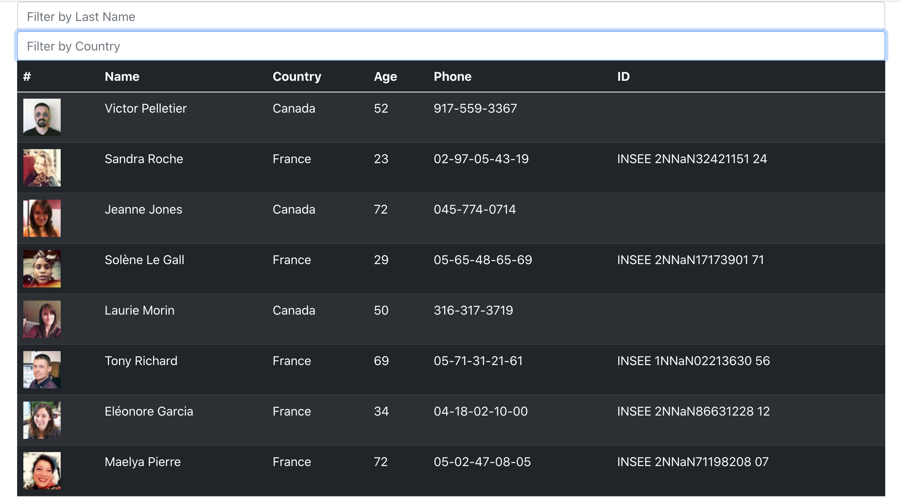
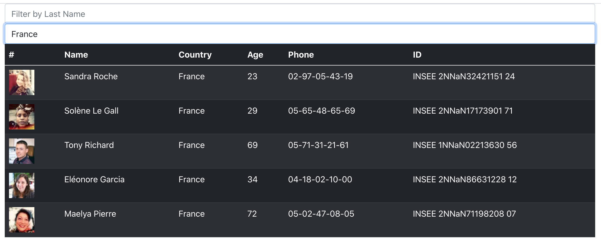

# Employee Directory- What does the project do?

This is a system that is intended to be used by a company where they are required to list all the employees with their details in a list in addition to be able to filter based of their details.

### Links to the project

* GitHub Repo:
(https://github.com/sosingh1226/employeeDirectory)

* Deployed Heroku Link: 
(https://empdir1947.herokuapp.com/)

## Challenges

Getting the API data on the frontend using React. Filter feature. Sort feature.

